# README

## 编程环境

pycharm， python3.8

Macintosh 12.4

## 任务定义

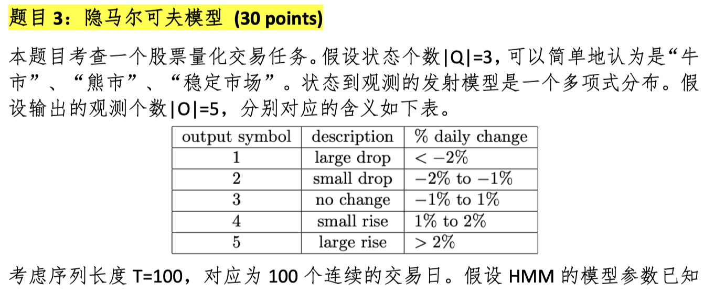

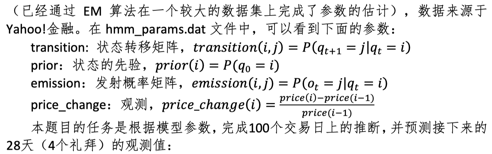

## 方法描述与对应结果分析

该题目分为3个小问：

### 第一小问

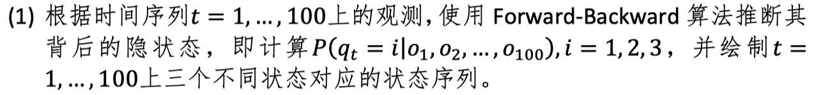

**代码：FB_algorithm.py**

1. 定义主算法函数：

```python
def Forward_Backward(HmmParams, num_HiddenState, len_HiddenState)
"""
HmmParams：从hmm_params.mat读取的字典类型参数
num_HiddenState：隐藏变量的种类数
len_HiddenState：隐藏状态链长度，也为观测链长度
"""
```

2. 定义子函数：

```python
def Forward(params, num, len)
"""
前向传播算法
params：传入主算法函数的HmmParams
num：传入主算法函数的num_HiddenState
len：传入主算法函数的len_HiddenState
return：alpha矩阵（3*100）
"""
def Backward(params, num, len)
"""
后向传播算法
params：传入主算法函数的HmmParams
num：传入主算法函数的num_HiddenState
len：传入主算法函数的len_HiddenState
return：beta矩阵（3*100）
"""
```

3. 具体算法：先使用Forward算法逐个求出alpha矩阵，由以下公式：
    $$
    \alpha_k(z_k)=\sum_{z_{k-1}}\alpha_{k-1}(z_{k-1})P(z_k|z_{k-1})P(x_k|z_k)
    $$
    再由Backward矩阵算出beta矩阵，由以下公式：
    $$
    \beta_k(z_k)=\sum_{z_{k-1}}P(z_{k+1}|z_{k})P(x_{k+1}|z_{k+1})\beta_{k+1}(z_{k+1})
    $$
    其中zk是[1, T]范围内k时刻的隐藏变量，T为观测序列长，此处为100；xk为zk的观测变量。

    在算完alpha和beta矩阵后，两个矩阵的乘积即为最终的100天的隐藏变量（shape：3*100）预测矩阵（需要归一化），并用argmax选中预测状态，生成预测状态链pred。

4. 输出：

    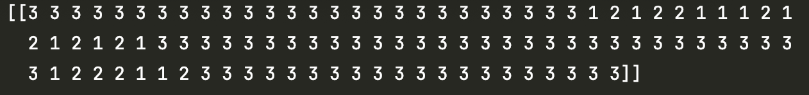

    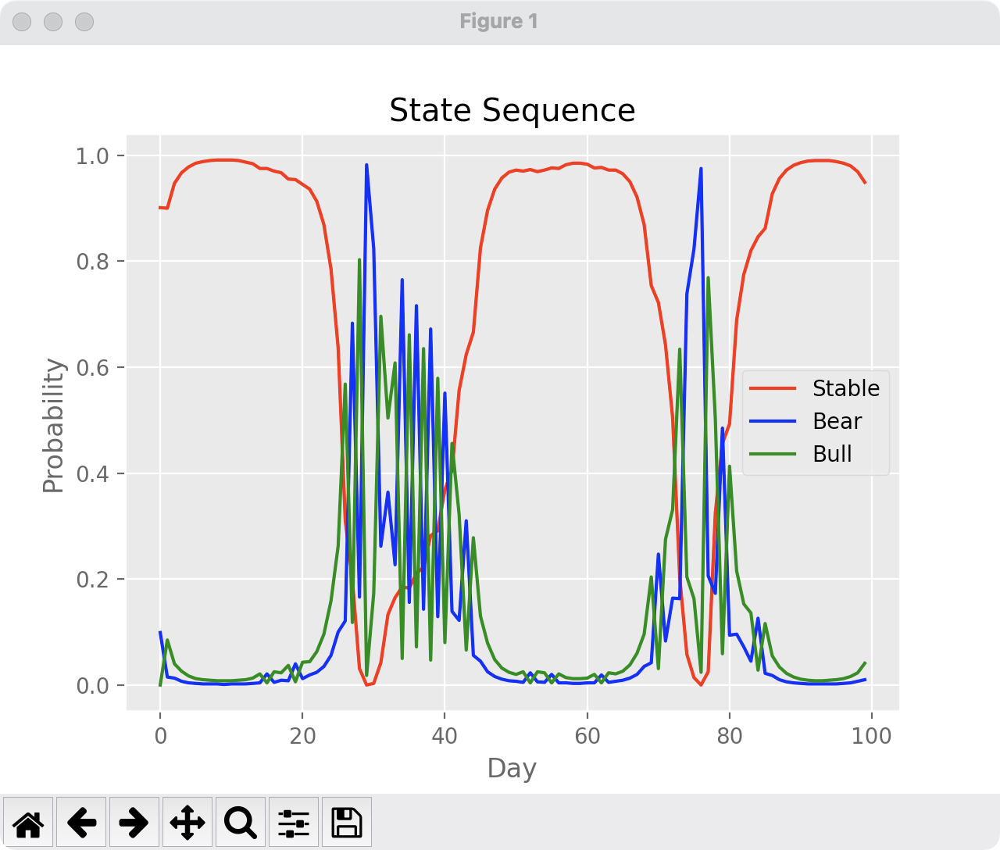


5. 结果分析：预测结果还是比较符合常理。原先分析过100天内的观测序列，大部分时间的output symbol都为3（no change），因此可推测大部分的时间都在稳定市场上，结果也比较符合这个水准，只有一部分时间有波动。


### 第二小问

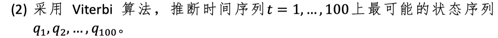

**代码：Viterbi_algorithm.py**

1. 代码实现全部借鉴该算法流程：

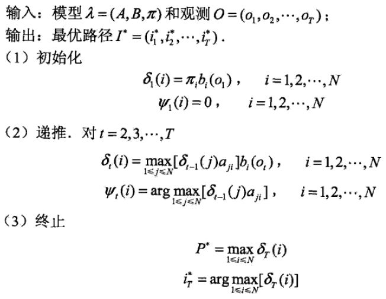


2. 编写对应的伪代码：

上述的矩阵A/a对应着transition状态转移矩阵，B/b矩阵对应着emission发射矩阵，pi矩阵对应着prior矩阵。如此下来，可以很轻松地编写出如下的代码：

#### 初始化

```python
sigma: N*T
psi: N*T
bestPath: 1*T
for i in range(N):
		x = obs[0]
		sigma[i, 0] = prior[i]*emis[i, x]
		psi[0, i] = 0
```

#### 递推

```python
for t in range(1, T):
		for i in range(N):
				for j in range(N):
						xt = obs[t]
						sigma[i, t] = max(sigma[j, t-1] * 
										transition[j, i] *
										emis[i, xt])
				for j in range(N):
						psi[i, t] = argmax(sigma[j, t-1] *
										transition[j, i])  # j
```

#### 终止

```python
finalProb = max([sigma[i, T] for i in range(N)])
Terminal = argmax([sigma[i, T] for i in range(N)])  # i
```

#### 最优路径回溯

```python
bestPath[T] = Terminal
for t in np.arange(T-1, -1, -1):
  	bestPath[t] = psi[bestPath[t+1], t+1]
```

3. 输出最优路径：

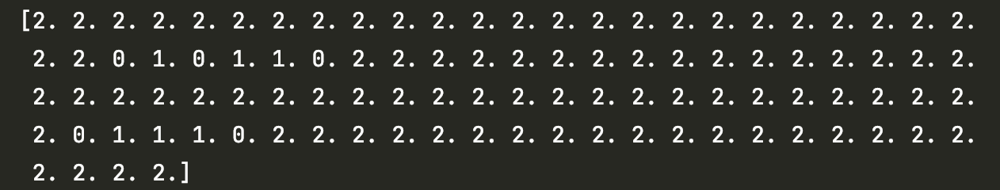

4. 结果分析：在这次结果中状态编号为0、1、2，可以看到大部分时间仍在稳定市场上。有波动的时间段与用FB算法得出结果的波动时间段相似。结果比较合理。


### 第三小问

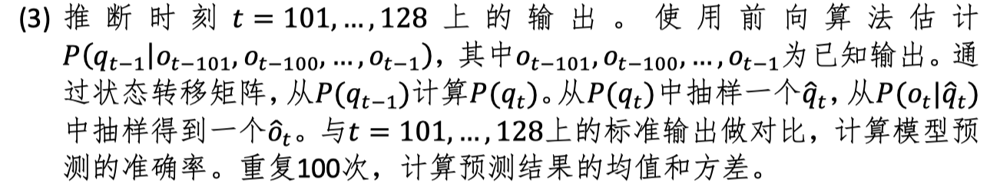

1. 此次结果需要用到FB算法所预测的模型。取其第一百天的三个状态的预测概率值，预测将来的28天市场走向，并随机抽样分析结果。
2. 定义主算法函数：

```python
def FuturePrediction(transition, emission, price_change, previousPred)
"""
预测未来28天的输出
transition：状态转移矩阵
emission：发射矩阵
price_change：观测队列
previousPred：用FB算法求出的前100天预测概率矩阵
return：result，delta（与标准观测值的差）
"""
		_next28Day = np.zeros((28,3))  # 将来28天的隐藏变量预测矩阵
		obsState = np.zeros((28,5))  # 将来28天的观测变量预测矩阵
		result = np.zeros((1, 28))  # 28天的观测结果
```

3. 初始化未来28天内第一天的市场状态：

```python
_next28Day[0] = np.dot(previousPred[T - 1], transition) * emission[:, price_change[T]]
obsState[0] = np.dot(_next28Day[0].T, emission)
```

4. 预测将来的28天：

```python
for i in range(1, 28):
    temp = np.dot(_next28Day[i - 1],transition)
    _next28Day[i] = temp * emission[:, price_change[i + T]]
    obsState[i] = np.dot(_next28Day[i], emission)

for i in range(28):
    obsState[i] = obsState[i] / np.sum(obsState[i])
    for j in range(1, 5):
        obsState[i][j] += obsState[i][j - 1]
```

5. 随机采样：

```python
for i in range(100):
    for j in range(28):
        rand = np.random.random()
        for k in range(5):
            if rand < obsState[j][k]:
                result[0][j] += k
                break
```

6. 返回：

```python
result = (result/100)[0]
delta = price_change[100:128] - result  # 预测值与真实值的差别
return result, delta
```

7. 结果分析：

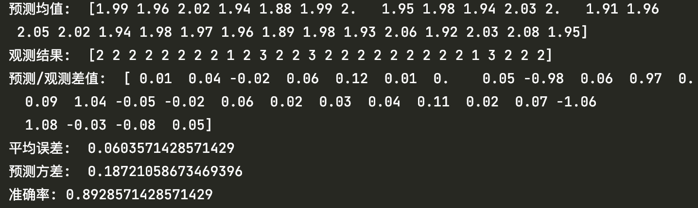

在准确率方面，我设置的误差范围大小为0.99，即预测均值与标准观测结果差在1以内就算做预测正确。可以看到准确率达到了百分之九十左右，即在28天内仅有两三天的结果是有较大偏差的。

## 附加题

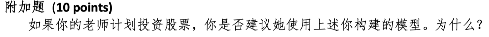

我不建议老师使用我的模型。首先，从数据量来说，仅仅使用100天的数据来预测未来股票趋势走向是不足的、不合适的，因为在现实世界中有许许多多影响股票趋势的因素存在。其次，在本次实验的模型中单单考虑概率是不足的，每天所给定的HMM概率参数都在更新，例如股票市场状态的先验概率、状态转移矩阵、发射矩阵这些参数都会跟随着当天市场、社会行业变动而不断调整。

